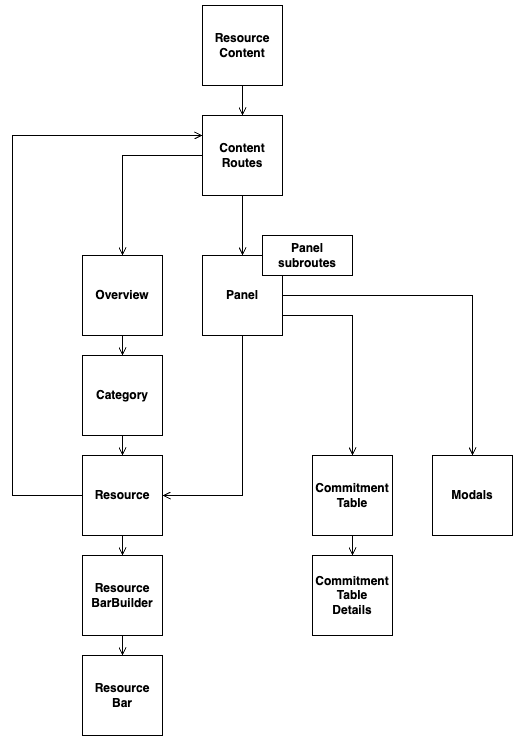
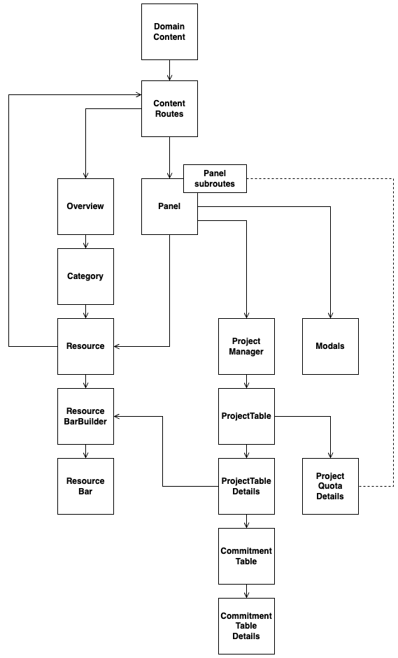
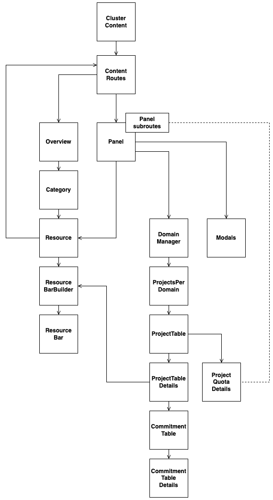
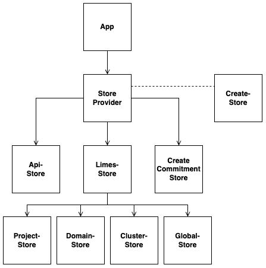
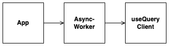

# LimesUI Architechture

This document aims to provide a more detailed view into the structure of LimesUI.
It covers how it's build and what files you might have to look at if any modifications or bug fixes need to be performed.

## Fundamentals and Source structure

LimesUI is a UI created in React. It utilizes components to create the different building blocks of the UI.
Components are structured with the following contents:

- Props (Properties): Components can call other components. Props are parameters that get provided to the next component.
- Hooks: State variables that memorize the UI interactions of the user and change the behaiviour of the UI.
- Functions: State changes of the UI call functions that can modify state variables.
- Return values: HTML-Code that gets displayed on the UI and is conditionally created (Dependent of the current state).

The structure of the LimesUI source code can be viewed in the `/src` directory.
Every subdirectory contains the components to display a part of the UI.

## Components

The UI contains the following UI views:

- Project level: Users can view and edit resources on project level.
- Domain level: Users can view and edit resources on domain level.
- Cluster level: Users can view and edit resources on cluster level.

It is important to note that components are reused at each level. The following images will clarify this.

### Project level:

The following graphic displays the Code structure of the project level UI:

Each box represents a component in the UI. They have the following purposes:

| Component              |                                                 Purpose                                                 |
| ---------------------- | :-----------------------------------------------------------------------------------------------------: |
| Resource Content       |                  Loads project and commitment data. Implements the routes for the UI.                   |
| content Routes         | Uses the React Router to provide different endpoints for the UI. Each Limes area has it's own UI route. |
| Overview               |                    Provides the basic layout for the UI. F.e. the Tabs of the areas                     |
| Category               |                 The tiles that represent the resources are divded by their categories.                  |
| Resource               |            Displays the data for the resource tiles. Also provides rerouting to the Panels.             |
| ResourceBarBuilder     |                    Provides the calculations to display the resource bars properly.                     |
| ResourceBar            |                        Provides the CSS to display the different resource bars.                         |
| Panel                  |                            Displays the panel to create or edit commitments.                            |
| CommitmentTable        |                      Displays the commitments. Filtered per resource and their AZ.                      |
| CommitmentTableDetails |     Provides the table rows for the commitments. Also includes the form components to create them.      |
| Modals                 |                 Contain the components and the logic to confirm or delete commitments.                  |

### Domain level:

The following graphic displays the Code structure of the domain level UI:

The differences to the project-level components will be explained:

| Component           |                                                Purpose                                                 |
| ------------------- | :----------------------------------------------------------------------------------------------------: |
| Domain Content      |      Fetches the limes domain data to create the same UI layout as seen in the project level UI.       |
| ProjectManager      |     Fetches the limes project data to display the correct values for the projects within a domain      |
| ProjectTable        |     Handles the table logic. F.e. sorting or ensuring only one project can display its commitments     |
| ProjectTableDetails |   Queries the commitments of a project. Displays the row values for the projects within the domain.    |
| ProjectQuotaDetails | The user can edit the Max-Quota for the resource of the projects. Only accessible via a panel subroute |

### Cluster level:

The following graphic displays the Code structure of the cluster level UI:

The differences to the domain-level components will be explained:

`Important: The ClusterUI displays the capacity in the Overview. While project/domain display the Quota.`

| Component         |                                                         Purpose                                                          |
| ----------------- | :----------------------------------------------------------------------------------------------------------------------: |
| ClusterContent    |              Fetches the limes cluster data to create the same UI layout as seen in the project level UI.                |
| DomainManager     |                                   Fetches the details of the domains within a cluster.                                   |
| ProjectsPerDomain | Contains a API multiFetch to get all projects of all domains to display a similar Panel structure as in the domain view. |

The fetched projects of all domains will be converted into a flattened structure.
In this form the projects of all domains can be provided to the same ProjectTable that the domain view uses.

## Store

The store contains the variables that need be accessible throughout the lifetime of the UI.
The difference between State and the Store is the following:

- State: Remembers a variable value throughout rerenders for a component. Can be passed to components that the parent component calls.
- Store: Remembers variable values throughout rerenders that can be accessed from components other than the direct decendents of a parent component.

The following image displays an overview of the store structure:

Each store contains:

- Store: The area where the variables are stored.
- StoreActions: Getter and Setters that the components can use to modify the variable values.

The Store Creator defines which stores are visible for the Store Provider. The Store Provider then exposes the desired store variables to the application.

The UI aims to have multiple store files to cover the different use-cases of the UI. They are the following:

### apiStore

Stores the endpoint (limes URL), the access token and ID's necessary to communicate to the limes API.

### createCommitmentStore

Stores various variables to create/delete/transfer a commitment.

### limesStore

Stores the data that are provided by the limes API for Cluster/Domain/Project level. This store contains sub-stores for the different abstraction levels.

- Cluster-Store: Saves the cluster data that gets fetched via the Limes Cluster API. It also stores the domains of a cluster. The project details for each domain have to be queried seperately. They get attached to each domain. The projects will be provided to the `ProjectTable` component in a flattened form.

- Domain-Store: Saves the domain data that gets fetched via the Limes Domain API. It also stores the project details for the current domain. It also contains the logic to sort the projects for a domain within the PanelView. The projects will be provided to the `ProjectTable` component are are already in a flattened form.

- Project-Store: Saves the project data that gets fetched via the Limes Project API. It also stores the commitment details for the current project. Those get filtered by the AZ. Each EditPanel tab that represents a AZ can then display the corresponding commitments of an AZ.

The store is utilized in a cascading form.
The Cluster-Store stores the domains. The flattened domain objects get attached to the domain store. The data can then be sorted there and can be provided to the underlying components. The commitments that should then be displayed for a selected project are stored in the project store.

## API Queries

The API queries utilize the `useQuery` library which provide hooks to create the queries with. The following image displays the structure of how it is implemented:

The advantage of an AsyncWorker is that it can provide a selected subset of the defined queries to the App. It also allows to define multiple query files and whether they should display Mock API data in development mode.

The advantage of `useQuery` is that we can customize and use caching and re-query functionalities that are provided by the hooks. Some examples:

- Caching: The query results will be saved for a couple of minutes. This ensures that by opening a Panel of a different resource and switching back to the previous one, the project data within the cache will be provided if no differences are present in the datasets.
- Requeries: Requeries are enabled at on window focus. This means the UI updates its values without the need of a page reload. Requeries are also initiated when the user interacts with the CRUD API operations.
- Error and Loading handling: The hooks provide information about the query states. They are untilized to display error messages or loading indicators at the UI.
